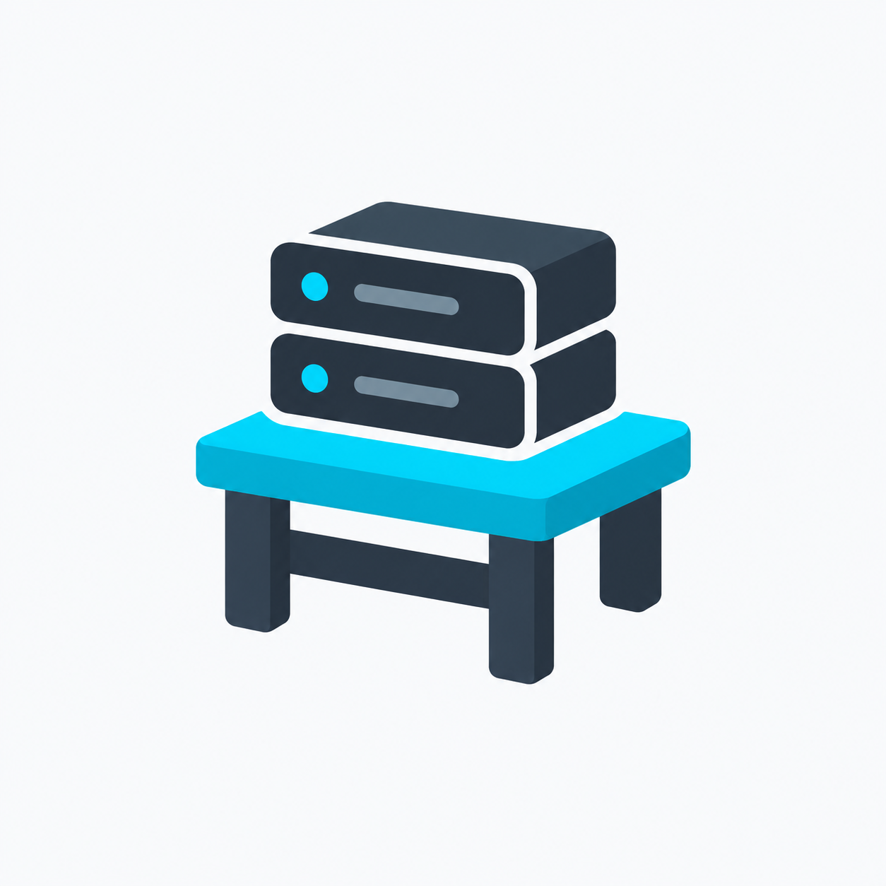
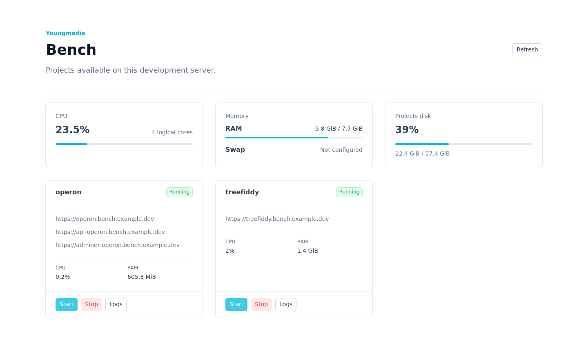

<p align="center">
  
</p>

<h1 align="center">Bench</h1>

<p align="center">
  <strong>Reprodukovatelný headless Ubuntu server pro vývoj webových projektů.</strong>
</p>

<p align="center">
  <a href="#quickstart">Quickstart</a> ·
  <a href="#benchyml">bench.yml</a> ·
  <a href="#bench-cli">CLI</a> ·
  <a href="#dokumentace">Dokumentace</a>
</p>



Bench připraví z čisté instalace Ubuntu soukromý vývojový server, na kterém lze
Docker Compose projekty spouštět jedním příkazem a bezpečně zpřístupnit přes
HTTPS. Přístup zajišťuje Tailscale, routing Caddy a správu projektů příkaz
`bench` nebo webový Bench Manager.

Projekt je určený pro jeden server a jednoho vývojáře nebo malý tým v jednom
tailnetu. Celá systémová konfigurace žije v Ansible a lze ji bezpečně spouštět
opakovaně.

## Co Bench instaluje

| Součást | Úloha |
| --- | --- |
| Git a základní balíčky | Běžné nástroje pro práci s projekty |
| Docker Engine a Docker Compose | Izolované spouštění projektů |
| Tailscale | Privátní síťová cesta k SSH, Manageru a aplikacím |
| Caddy | Wildcard HTTPS a reverse proxy na projektové kontejnery |
| `bench` CLI | Inicializace, spuštění, zastavení a logy projektů |
| Bench Manager | Webový přehled projektů a vytížení serveru |
| Node.js 24 | Runtime pro CLI a Manager |
| Bubblewrap a AppArmor profil | Izolovaný sandbox použitelný například Codexem |

Provisioning také vytvoří adresář projektů (výchozí `~/Projects`) a externí
Docker network `bench-proxy`. Caddy publikuje porty pouze na Tailscale IPv4
adrese; projektové kontejnery nemusí publikovat porty ani upravovat svůj Compose
soubor kvůli Benchi.

## Quickstart

Potřebujete Ubuntu Server 24.04 nebo 26.04 LTS na AMD64 či ARM64, uživatele se
`sudo`, existující Tailscale tailnet, vlastní doménu a DuckDNS účet pro ACME DNS
challenge. Podrobná příprava DNS je v [instalační dokumentaci](docs/installation.md).

```bash
git clone https://github.com/tusil/bench.git
cd bench
cp .env.example .env
$EDITOR .env
./bootstrap.sh
```

Po dokončení se odhlaste a znovu přihlaste, aby se projevilo členství ve
skupině `docker`. Potom přidejte první Compose projekt:

```bash
cd ~/Projects/my-project
bench init
$EDITOR bench.yml
bench up
```

`bench up` spustí projekt, připojí routované kontejnery k proxy síti a vypíše
jejich HTTPS adresy. Manager je dostupný na doméně nastavené v `BENCH_DOMAIN`.

## `bench.yml`

Každý spravovaný projekt má v kořeni jednoduchý konfigurační soubor:

```yaml
name: operon

routes:
  - service: frontend
    port: 3000

  - domain: api-operon.bench.example.dev
    service: backend
    port: 3333
```

Pokud route nemá `domain`, Bench použije `{name}.<BENCH_DOMAIN>`. Explicitní
doména musí být právě jednu úroveň pod základní doménou, aby ji pokryl wildcard
certifikát. Volitelné vlastní příkazy a kompletní pravidla popisuje
[konfigurace projektů](docs/projects.md).

## Bench CLI

| Příkaz | Popis |
| --- | --- |
| `bench init [--name slug]` | Vytvoří základní `bench.yml` v aktuálním adresáři |
| `bench init --template name [--name slug]` | Vytvoří projekt z nakonfigurované Git šablony |
| `bench up` | Spustí projekt a zpřístupní jeho routy |
| `bench down` | Odebere routy a zastaví projekt |
| `bench logs [--tail N] [--follow]` | Zobrazí logy Compose projektu |
| `bench list --json` | Vypíše projekty a jejich stav pro automatizaci |
| `bench stats --json` | Vypíše systémové a projektové metriky |
| `bench --help` | Zobrazí nápovědu |

## Dokumentace

- [Instalace a DNS](docs/installation.md)
- [Konfigurace projektů](docs/projects.md)
- [Provoz a ověření](docs/operations.md)

## Aktuální hranice

Bench zatím neřeší firewall, zálohy, správu secrets, Portless, exit node ani
subnet routing. Tailscale SSH se nezapíná; přístup k
serveru používá standardní OpenSSH přes privátní Tailscale síť.
